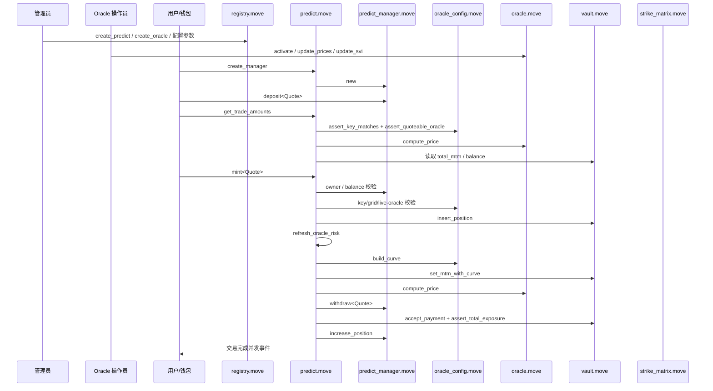
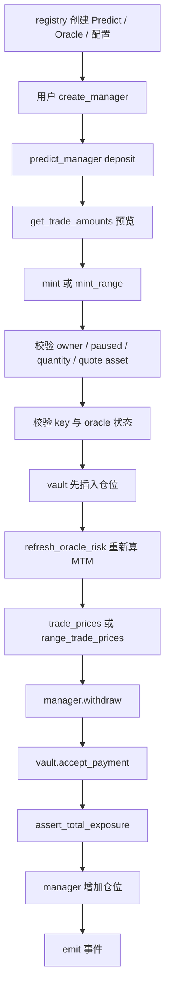
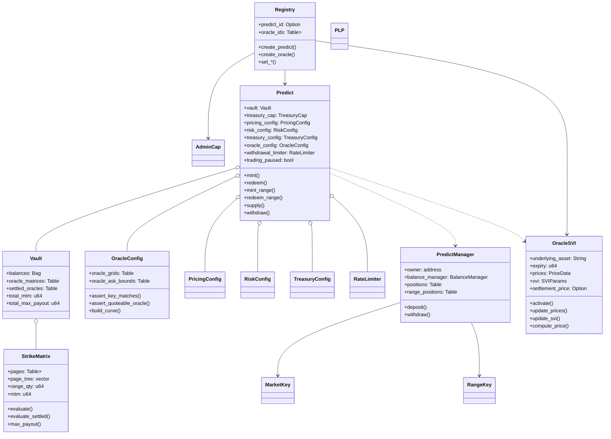
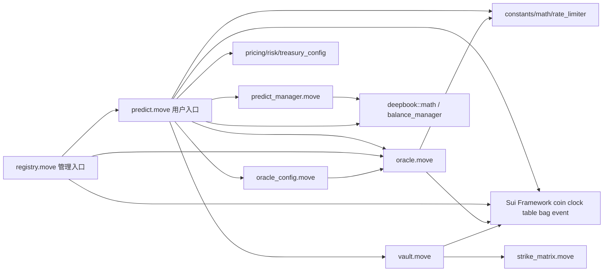

# deepbook predict 模块架构解析

## 源码范围确认

这次源码侦察的第一结论，是先**纠正名词预期**：`deepbookv3` 仓库里的 `predict` 不是机器学习里的“预测 / inference / serving”模块，而是一个**在 Sui 上实现到期型 prediction market 的 Move 协议包**。`packages/predict` 目录下自带的 README 直接把它定义为 “expiry-based prediction market protocol on Sui”，并把核心对象列为 `Predict`、`PredictManager`、`OracleSVI`、`PLP`；同一个 README 还明确把对外读路径拆成 public `predict-server`、Sui 实时流、链上对象直读三类，这进一步说明它是**链上协议 + 链下索引/服务**的组合，而不是模型推理流水线。

基于可访问源码，我最终确认的**主范围**不是单一文件，而是一个**分散式实现**：

| 类型 | 最终确认路径 | 结论 |
| --- | --- | --- |
| 主模块边界 | `packages/predict/sources/` | 这是 `predict` 的真实源码边界，包含交易编排、治理入口、oracle、vault、配置、数据结构和数学辅助模块。 `packages/predict` 根目录只暴露 `simulations`、`sources`、`tests/helper`、`Move.toml`、`README.md`。 |
| 主编排文件 | `packages/predict/sources/predict.move` | 用户交易、LP 供给/赎回、风控刷新、价格计算与事件发射都集中在这里，是“阅读入口中的入口”。 |
| 管理/治理入口 | `packages/predict/sources/registry.move` | `AdminCap`、`Registry`、`create_predict`、`create_oracle` 以及所有管理员配置入口都在这里， 说明它是 ops/governance 层。 |
| 用户账户边界 | `packages/predict/sources/predict_manager.move` | `PredictManager` 持有用户 quote 余额、单腿仓位和 range 仓位； README 也说明 position/range 并不是独立对象。 |
| oracle 子系统 | `packages/predict/sources/oracle.move` 与 `oracle_config.move` | 前者负责共享 oracle 状态与精确定价原语， 后者负责 strike-grid、staleness/liveness 策略、curve 构造与 ask-bound override。 |
| 风险/资金状态机 | `packages/predict/sources/vault/vault.move` 与 `helper/strike_matrix.move` | `Vault` 管理资产与聚合风险， `StrikeMatrix` 保存每个 oracle 的离散化风险面并支持 MTM / max payout 计算。 |

源码侦察阶段识别出的**候选路径**以及判断理由如下：

| 候选路径 | 为什么相关 | 最终判断 |
| --- | --- | --- |
| `packages/predict/` | 目录名直接命中； 根下有 `Move.toml`、`README.md`、`sources`、`simulations`、`tests/helper`。 | 相关，但只是包根，不是唯一实现点。 |
| `packages/predict/sources/` | 所有 Move 模块源码都在这里。 | **主实现边界**。 |
| `packages/predict/simulations/` | README 说这是 “localnet harness for the `predict` package”， 包含 `src/`、`data/`、`run.sh`、`visualize.py`，是验证/演示相关而非协议主逻辑。 | 相关但非重点。 |
| `packages/predict/tests/helper` | 包根 tree 中以压缩路径 `tests/ helper` 出现，说明存在测试支撑目录。 | 相关但当前不可完整枚举。 |
| `PREDICT_MIGRATION.md` | 这是迁移计划文档，列出智能合约、测试、indexer、server、scripts、CI 的候选路径， 适合作为侦察地图。 | 相关但不是源码。 |
| `crates/`、`scripts/`、`docker/`、`.github/workflows/` | 仓库根目录中存在这些顶层目录； 迁移计划也提到未来/阶段性会有 `predict-schema`、`predict-indexer`、`predict-server`、oracle services、deploy workflow。 | 可能相关，但**本次无法从可访问源码确认具体 predict 子路径是否已在该分支落地**。 |

因此，后续分析都基于这个**范围确认**展开：

- **predict 主模块路径**：`packages/predict/sources/`
- **编排核心**：`packages/predict/sources/predict.move`
- **相关但非重点**：`registry.move`、`predict_manager.move`、`oracle.move`、`oracle_config.move`、`vault/vault.move`、`helper/strike_matrix.move`、`config/*`、`simulations/`
- **关键入口文件**：`predict.move`、`registry.move`、`predict_manager.move`、`oracle.move`
- **排除项**：仓库中未发现任何可确认的 ML `model / checkpoint / dataloader / inference engine / serving runtime` 实现；用户原问题里这些分类在本仓库的 `predict` 语义下不成立。
- **未能从源码确认的边界**：`tests/helper` 内部具体文件、`i64.move`、`plp.move` 的源码正文，以及本分支是否实际包含 `crates/predict-server` 一类链下实现；它们只能从文档或导入关系侧面推断，不能当作已确认事实。

## 模块定位与系统边界

`predict` 在 deepbook 整体系统里的职责，不是“生成预测结果”，而是**管理预测市场交易、抵押资金、oracle 驱动定价、LP 份额、管理员配置和事件输出**。README 用一句话概括为“expiry-based prediction market protocol on Sui”；`predict.move` 则在模块头注释中把自己定义为 “Main entry point for the DeepBook Predict protocol”，负责把 vault、oracle config、manager 和 pricing 层编排成对外交易流程。

这决定了它和周边模块的边界非常清晰：

- **`predict.move` 负责“编排”**：用户入口、LP 入口、价格预览、实际执行、事件发射、风控刷新、配置透出与部分 package-private admin 逻辑，都在这里。
- **`registry.move` 负责“治理与装配”**：`Registry`、`AdminCap`、`create_predict`、`create_oracle` 和所有管理员 setter 都在这里；它不是交易引擎，而是协议初始化与配置门面。
- **`predict_manager.move` 负责“用户账户状态”**：用户 quote 余额复用 DeepBook 的 `BalanceManager`，仓位则存放在 `positions: Table<MarketKey, u64>` 和 `range_positions: Table<RangeKey, u64>`。`predict.move` 只消费这个对象，不负责其内部存储实现。
- **`oracle.move` 负责“oracle 生命周期与精确 fair price”**：它维护 `OracleSVI` 的 activation、价格更新、SVI 参数更新、settlement 状态机，以及对任意 strike 的 `compute_price`。它本身不处理离散 strike-grid、staleness 政策或 vault MTM 近似曲线。
- **`oracle_config.move` 负责“Predict 特有的 oracle 覆盖层”**：grid 合法性、`MarketKey`/`RangeKey` 的校验、oracle freshness policy、ask-bound override、adaptive curve 采样，都属于这个层。它解释了为什么 `oracle` 与 `oracle_config` 被拆成两个模块。
- **`vault.move` 负责“资金与风险状态机”**：持有 quote 资产、保存 per-oracle 风险矩阵、聚合 `total_mtm` 与 `total_max_payout`，但**不负责定价公式**。它接受 `predict.move` 已经决定好的插入/移除/支付/风险刷新调用。
- **`strike_matrix.move` 负责“每个 oracle 的离散风险面数据结构”**：这是阅读成本最高、但又最关键的底层抽象。注释明确写出它同时服务两类查询：live curve 下的 MTM 和 settled 场景下的 exact max payout，因此采用 “page + inline summary tree” 的混合布局。
- **配置模块 `pricing_config / risk_config / treasury_config` 负责“参数与校验”**：它们不是配置文件解析器，而是链上配置对象。默认值来自 `constants.move` 的宏，修改入口经 `registry.move` 暴露。

这也意味着，用户问题里提到的“训练、数据处理、特征工程、模型加载、推理执行、结果输出”在这里都要重新翻译：

| 用户问题里的术语 | 在本模块里的真实对应物 | 结论 |
| --- | --- | --- |
| 训练 / checkpoint / weights | 不存在 | 未从源码发现任何 ML 训练或模型权重逻辑。 |
| dataset / dataloader | 不存在 | 输入是链上对象、coin、clock、oracle 状态，不是批量样本。 |
| feature engineering | `oracle_config::build_curve` 与 `oracle::compute_price` 更接近“风险估值输入转换” | 但它不是特征工程，而是离散化定价辅助。 |
| inference engine | `predict::mint / redeem / supply / withdraw` 的 Move 交易执行 | 更准确叫“协议执行 / pricing orchestration”。 |
| serving / API | README 里的 `predict-server` 是链下读模型 API； 源码主逻辑仍是 Move entrypoints | 服务器源码本次未能确认。 |
| model output | 事件、对象状态、返回的 `Coin` / `ID` / quote amount | 不是 tensor 或 prediction scores。 |

这类“语义错位”本身就是维护者的第一阅读陷阱。README 已经强调使用 `predict-server` 渲染大多数页面，同时用链上读做确认关键路径；这能帮助你把**链上协议**与**链下读模型**分层理解，而不是把整个 `predict` 想成单体服务。

## 目录结构与职责划分

`packages/predict` 不是一个“目录即模块”的简单结构，而是一个典型的**协议包 + 支撑子系统**布局：`sources/` 放链上模块，`simulations/` 放本地仿真，`tests/helper` 表明有测试支撑目录，但可见树中没有直接露出完整测试入口。

| 层次 | 路径 | 职责 | 说明 |
| --- | --- | --- | --- |
| 包定义层 | `packages/predict/Move.toml` | Move 包声明；包名 `deepbook_predict`，依赖本仓库 `../deepbook` | 它定义了编译边界和对 DeepBook 主包的内部依赖。 |
| 协议入口层 | `sources/predict.move` | 用户交易与 LP 流程的主入口 | `mint / redeem / mint_range / redeem_range / supply / withdraw / get_trade_amounts / ask_bounds` 全在这里。 |
| 治理入口层 | `sources/registry.move` | 管理员/部署者入口 | `create_predict`、`create_oracle`、quote asset enable/disable、spread/risk/withdrawal limiter setters 都由这里向外暴露。 |
| 用户状态层 | `sources/predict_manager.move` | 用户资金账户与仓位表 | 对外暴露 `deposit / withdraw / balance / position / range_position`， 内部持有 `BalanceManager`、`DepositCap`、`WithdrawCap`。 |
| oracle 核心层 | `sources/oracle.move` | 共享 oracle 对象与精确 Fair Price 原语 | 管理 `OracleSVI`、`OracleSVICap`、状态机、SVI 参数和 `compute_price`。 |
| oracle 覆盖层 | `sources/oracle_config.move` | grid、liveness/freshness、curve builder、ask bounds | 这些都不是通用 oracle 概念，而是 Predict 协议对 oracle 的“使用约束”。 |
| 资金状态机层 | `sources/vault/vault.move` | Vault 余额、oracle 风险矩阵、聚合 MTM / max payout | 文件注释直说 “pure state machine for trade execution”， 且把 pricing 责任显式留给 `predict.move`。 |
| 风险数据结构层 | `sources/helper/strike_matrix.move` | MTM / max payout 的底层离散数据结构 | 它不是通用 util，而是 vault 风险评估的专用核心。 |
| 小型配置层 | `sources/config/pricing_config.move` `risk_config.move` `treasury_config.move` | 链上参数对象与验证 | spread、ask bounds、总暴露比例、quote allowlist 都在这些小模块中。 |
| 基础工具层 | `sources/helper/constants.move` `math.move` `rate_limiter.move` | 常量、定点数学、提款限流 | 被上层多个模块复用，但语义仍强烈服务于 Predict。 |
| 键结构层 | `sources/market_key/market_key.move` `range_key.move` | Position / Range 的统一键抽象 | `PredictManager` 和 `Vault` 都通过这些 key 对齐仓位。 |
| 仿真/验证层 | `simulations/` | 本地 localnet harness 与可视化 | README 明说这里用于跑 simulation、产出 `results.json`、再渲染图表。 |
| 测试支撑层 | `tests/helper` | 测试辅助目录 | 包 tree 中只可见压缩后的 `tests/helper`，但无法在本次会话中枚举内部文件。 |

一个很重要的组织原因是：**协议入口和状态机是刻意拆开的**。`predict.move` 只掌握“何时调用哪个子系统、先后顺序是什么、何时发事件”；`vault.move` 和 `strike_matrix.move` 则被做成尽量纯的状态与计算模块。这种分层使得阅读者可以把“业务动作顺序”和“底层风险代数”分开理解，而不用在一个文件里同时追踪所有问题。

## 主流程与调用链

从维护者角度，最值得先掌握的不是“所有 public fun”，而是**最常见的用户路径：创建账户 → 充值到账户 → 预览报价 → mint / redeem**。README 也按这个顺序写了 quickstart：先从 server 获取市场状态，再创建/查找 manager，再给 manager 充值，然后使用 `predict::mint`、`predict::redeem` 等交易入口。

常见入口并不是 CLI，也不是仓库内可见 HTTP handler，而是两类调用面：

- **链上事务入口**：`predict::create_manager`、`predict::mint`、`predict::redeem`、`predict::mint_range`、`predict::redeem_range`、`predict::supply`、`predict::withdraw`，以及管理员通过 `registry::*` 调用的部署/配置入口。README 还建议用 `@mysten/codegen` 生成绑定，而不是手写目标字符串。
- **链下读入口**：`predict-server` 的 REST surface，以及 Sui event/checkpoint stream；README 明确建议用 server 做列表/历史/摘要渲染，用实时流追 oracle 新鲜度，用链上读做钱包关键确认。

下面是“单腿仓位 mint”主流程的维护者视图。

再把它压缩成“代码阅读 flowchart”：

“最常见预测入口”的关键调用表，我建议维护者先按下面顺序跟：

| 顺序 | 文件 / 函数 | 作用 | 接口说明 |
| --- | --- | --- | --- |
| 起点 | `registry.move` `create_predict<Quote>` | 创建共享 `Predict` 对象 | 输入：`Registry`、`AdminCap`、`Currency<Quote>`、`TreasuryCap<PLP>` 输出：`predict_id` 备注：治理/部署入口。 |
| 起点 | `registry.move` `create_oracle` | 创建 oracle 并登记 grid | 输入：`Predict`、`OracleSVICap`、underlying、expiry、grid 输出：`oracle_id` 备注：交易前的市场装配。 |
| 起点 | `predict.move` `create_manager` | 为用户创建 `PredictManager` | 输入：`TxContext` 输出：`manager_id` 备注：README quickstart 明确要求先有 manager。 |
| 预备 | `predict_manager.move` `deposit<T>` | 给 manager 充可交易 quote 余额 | 输入：`Coin<T>` 备注：不在 `predict.move` 内部，属于用户账户边界。 |
| 预览 | `predict.move` `get_trade_amounts` | 预览单腿 mint/redeem 价格 | 输入：`Predict`、`OracleSVI`、`MarketKey`、`quantity` 输出：`(mint_cost, redeem_payout)` 备注：走 `trade_prices`。 |
| 执行 | `predict.move` `mint<Quote>` | 买入单腿仓位 | 输入：`Predict`、`PredictManager`、`OracleSVI`、`MarketKey`、`quantity` 备注：先改 vault，再按 post-trade liability 报 ask。 |
| 执行 | `predict.move` `redeem_internal<Quote>` | 卖出单腿仓位的共用逻辑 | 输入：同上 输出：`Coin<Quote>` 备注：`redeem` 与 `redeem_permissionless` 共享。 |
| 分支 | `predict.move` `mint_range<Quote>` / `redeem_range<Quote>` | 交易竖价差 range | 输入：`RangeKey` 备注：使用 `range_trade_prices`。 |
| 分支 | `predict.move` `supply<Quote>` / `withdraw<Quote>` | LP 供给与赎回 | 输入：`Coin<Quote>` / `Coin<PLP>` 输出：`Coin<PLP>` / `Coin<Quote>` 备注：不经过 `PredictManager`，直接与 vault/PLP 交互。 |
| 风险刷新 | `predict.move` `refresh_oracle_risk` | 重建单个 oracle 的 MTM | 输入：`Predict`、`OracleSVI` 备注：live 用 sampled curve，settled 用 settlement。 |
| 定价 | `predict.move` `trade_prices` / `range_trade_prices` | 生成 ask/bid | 输入：`Predict`、`OracleSVI`、`MarketKey/RangeKey` 输出：`(ask, bid)` 备注：单腿基于 `oracle.compute_price`；range 基于 `up(lower)-up(higher)`。 |
| oracle 辅助 | `oracle.move` `compute_price` | 某 strike 的 exact fair UP price | 输入：`OracleSVI`、`strike` 输出：`u64` 备注：settled 返回 0/1，live 返回 `N(d2)`。 |
| 曲线构造 | `oracle_config.move` `build_curve` | 为 vault MTM 构造离散曲线 | 输入：`OracleConfig`、`OracleSVI`、`min/max strike` 输出：`vector<CurvePoint>` 备注：只用于风险估值，不是用户直接报价。 |
| 状态机 | `vault.move` `insert_position/remove_position`、`set_mtm_with_curve` | 修改仓位与刷新聚合 MTM / max payout | 输入：`oracle_id`、仓位、曲线 备注：不做 spread 决策。 |
| 底层结构 | `strike_matrix.move` `insert/remove/evaluate/max_payout` | 维护每个 oracle 的离散风险面 | 输入：strike/range/curve 输出：MTM / max payout 备注：最重要但最底层。 |

一个非常值得单独点明的“组织理由”是：**mint 先把仓位写进 vault，再基于更新后的 liability 计 ask；redeem 则先从 manager/vault 中去掉仓位，再按去杠杆后的 liability 计 bid**。源码注释明确说，这样做是为了让买方为自己新增的 liability 付钱、让卖方只拿到自己移除 liability 之后的 payout。这一点如果没读懂，后续读 spread 和 MTM 很容易完全反着理解。

## 核心抽象与数据流

如果只能记住几个对象，请优先记住：`Predict`、`PredictManager`、`OracleSVI`、`OracleConfig`、`Vault`、`StrikeMatrix`、`MarketKey`、`RangeKey`。README 也几乎按这个顺序给出了概念模型。

下面这张关系图，是我认为最适合作为“源码阅读地图”的核心对象关系图：

这些抽象里，真正“必须先理解”的对象关系是：

- `Predict` 是**协议根对象**，几乎所有状态都通过它汇聚：vault、配置、oracle grid、PLP treasury cap、withdrawal limiter。README 也明确说前端应把它当 market root。
- `PredictManager` 是**用户侧账户对象**，不是订单对象也不是 NFT 容器，而是一个“资金账户 + 内部仓位表”。README 特别强调 position/range 不存在独立对象。
- `OracleSVI` 是**单 underlying + 单 expiry 的定价状态对象**，定价原语在这里，交易约束不在这里。它负责从 SVI 曲面推到单 strike 的 exact binary price。
- `OracleConfig` 是**Predict 对 oracle 的使用契约**：grid 限制、freshness policy、curve 构造、ask-bound override 都在这里。这个拆分非常合理，因为这些约束属于协议而不是 oracle 本体。
- `Vault` 是**资金与聚合风险状态机**，用 `StrikeMatrix` 保存每个 oracle 的风险面。`predict.move` 的注释和 `vault.move` 的注释共同表明：pricing logic 在 orchestrator，vault 只做状态变更和风险聚合。
- `StrikeMatrix` 是**整个模块里最值得专门做笔记的类比对象**。它并不是简单的 “strike -> qty” map，而是为了同时支持 MTM 与 exact max payout，构建了 page summary tree 与 page-local 聚合。你不理解它，就很难理解为什么 vault 的风险刷新要分 live curve 与 settled 两条路。

从数据流角度，这个模块几乎全部建立在几条固定约定上：

| 数据形态 | 真实类型 / 约定 | 重要性 |
| --- | --- | --- |
| 价格 / 百分比 | `u64`，使用 `FLOAT_SCALING = 1e9` | 全模块最重要的隐式约定；50% = `500_000_000`。 |
| 数量 / 合约面值 | quote 单位，README 与常量注释都写明 `1_000_000 = 1 contract = $1` | 决定 payout 与 vault balance 的量纲一致。 |
| Quote 资产 | 必须是允许的 coin type，且 decimals 必须为 6 | `TreasuryConfig` 与 `required_quote_decimals()` 共同约束。 |
| 单腿仓位键 | `MarketKey(oracle_id, expiry, strike, direction)` | `direction` 是 UP / DOWN；position table 只存 quantity。 |
| Range 键 | `RangeKey(oracle_id, expiry, lower_strike, higher_strike)` | `lower < higher`；方向不在 key 里。Bull-call 与 bear-put 同键。 |
| Oracle 生命周期 | `INACTIVE -> ACTIVE -> PENDING_SETTLEMENT -> SETTLED` | `assert_live_oracle` 与 `assert_quoteable_oracle` 的判定基础。 |
| 用户仓位存储 | `PredictManager.positions` / `range_positions` | 不是独立对象，不是 NFT。 |
| Live 风险刷新输入 | `oracle_config::build_curve(...) -> vector<CurvePoint>` | 不是精确全 strike 重算，而是 sample curve 估值。 |
| Settled 风险刷新输入 | `settlement_price` | 直接走 `evaluate_settled` 和 compaction。 |
| Range liability 偏移 | `range_qty` | 这是最容易漏读的重要隐式约定； 它必须从 `evaluate / evaluate_settled / max_payout` 结果里净掉。 |

我认为维护者最容易漏掉，但又最关键的隐式约定有十个：

| 容易误解点 | 正确理解 |
| --- | --- |
| `predict` 像推理服务 | 其实是 prediction market 协议。 |
| `Position` / `Range` 是对象 | 它们只是 `PredictManager` 内部表项。 |
| `oracle.move` 就包含所有 oracle 规则 | grid、freshness、curve builder 在 `oracle_config.move`。 |
| mint 报价是 pre-trade | 源码与注释表明它是 post-trade ask。 |
| redeem 报价是 pre-trade | 实际是 post-removal bid。 |
| range 是独立定价公式 | 其实是 `up(lower) - up(higher)`， settled 时只在 `(lower, higher]` 内支付 1。 |
| Vault 只看余额 | 还维护 `total_mtm` 与 `total_max_payout` 两个不同风险量。 |
| 历史 minted strike 范围会缩 | 不会；只扩不缩，空仓也可能沿旧范围重建 MTM。 |
| quote asset disable 后无法出金 | README 和 `redeem/withdraw` 注释都说明 outflow 可以用仍有 concrete vault balance 的资产。 |
| server 是交易入口 | server 主要是 read-model，写入口仍是链上 Move 调用。 |

## 配置、依赖与可观测性

`predict` 没有 YAML / argparse / env-file 这类传统服务配置系统；**配置本身就是链上状态**。默认值来自 `constants.move` 宏，在 `PricingConfig::new`、`RiskConfig::new`、`TreasuryConfig::new`、`RateLimiter::new` 以及 `Predict::create` 中被实例化，随后由 `registry.move` 暴露管理员修改入口。换句话说，这里所谓“配置系统”的真实含义是：**哪些参数被持久化为对象字段，谁能改，在哪个调用点生效**。

| 配置项 | 默认 / 类型 | 作用与位置 | 影响与注意 |
| --- | --- | --- | --- |
| `base_spread` | `20_000_000` `u64` | spread 主倍率 位置：`pricing_config::quote_spread_from_fair_price` | 改变所有 live ask/bid 注意：量纲是 1e9，不是百分数小数。 |
| `min_spread` | `5_000_000` `u64` | spread 下限 位置：同上 | 在 deep ITM/OTM 时仍保留最小点差 注意：容易被误解成“最小 ask 价”；其实不是。 |
| `utilization_multiplier` | `2_000_000_000` `u64` | 利用率惩罚系数 位置：同上 | vault 越接近满负载，spread 扩张越明显 注意：影响 live 定价，不影响 settled payout。 |
| `min_ask_price` | `10_000_000` `u64` | mint ask 下界 位置：`predict::assert_mintable_ask` | 阻止价格过低的新 mint 注意：是 post-spread ask 的约束，不是 fair price 约束。 |
| `max_ask_price` | `990_000_000` `u64` | mint ask 上界 位置：同上 | 阻止价格过高的新 mint 注意：可被 per-oracle override 收紧，但不能被放宽。 |
| per-oracle `AskBounds` | 无 `AskBounds` | 单 oracle 覆盖全局 ask 边界 位置：`oracle_config` + `predict::resolve_ask_bounds` | 对特定 oracle 收紧 mint 区间 注意：必须有对应 `OracleSVICap` 才能设置。 |
| `max_total_exposure_pct` | `800_000_000` `u64` | 总 MTM / balance 的风控上限 位置：`vault::assert_total_exposure` | 直接决定 mint/range mint 是否 abort 注意：这里约束的是 `total_mtm`，不是 `total_max_payout`。 |
| `accepted_quotes` | 空，创建 `Predict` 时先启用一个 Quote `VecSet<TypeName>` | 新 inflow 白名单 位置：`TreasuryConfig`、`mint`、`supply` | 决定哪些 coin type 可入场 注意：disable 后不代表已有资产不能出场。 |
| Quote decimals 约束 | `6` `u8` 宏 | 确保 quote 资产量纲一致 位置：`TreasuryConfig::add_quote_asset` | 决定资产能否被 enable 注意：这其实是“协议级固定约束”，不是可改配置。 |
| oracle strike grid | 创建 oracle 时确定 `min_strike / tick_size / max_strike` | 限定合法 strike 与 curve builder 范围 位置：`registry::create_oracle`、`oracle_config`、`vault::init_oracle_matrix` | 错配会导致 key 校验与风险矩阵都失效 注意：`max_strike = min + tick * oracle_strike_grid_ticks()`。 |
| oracle staleness threshold | `30_000ms` 宏 `u64` | live/quoteable oracle freshness 位置：`assert_live_oracle` / `assert_quoteable_oracle` | stale 时 mint/redeem 会 abort 注意：同样不是链上可改配置。 |
| curve sampling count | `50` 宏 `u64` | MTM 近似曲线采样点数量 位置：`oracle_config::build_curve` | 影响 live MTM 计算的近似精度与成本 注意：这不是用户报价的直接点数。 |
| withdrawal limiter capacity / refill | 创建时 0 且 disabled `u64/u64` | 限制 LP 出金速率 位置：`RateLimiter`、`predict::withdraw` | 控制 withdraw 何时可执行 注意：必须先 update，再 enable。 |

依赖关系上，主模块依赖可以压缩成下图：

稳定边界大体如下：

- **最稳定的公共写边界**：`predict.move` 的用户函数、`registry.move` 的管理员函数。
- **最稳定的公共读边界**：README 推荐的 `predict-server` REST endpoints 与链上对象只读；对 UI 而言，应尽量避免自己解码全部 Move event。
- **最脆弱的内部边界**：`predict.move` 到 `vault.move` / `strike_matrix.move` 的耦合，尤其是 `refresh_oracle_risk`、`range_qty` 净额约定、post-trade quoting 这三个点。它们不是坏设计，但非常依赖维护者记住一组跨文件隐式约定。

可观测性方面，链上模块基本只有两种机制：

- **abort code**：通过 `assert!` 抛出错误，没有统一异常基类，也没有“错误包装层”。各模块错误码独立，比如 owner 错误、oracle stale、invalid strike、ask out of bounds、withdraw rate-limited、vault 余额不足等。
- **event**：这是唯一真正系统化的“日志/可观测性”手段。`predict.move` 发 Position/Range/LP/配置事件，`oracle.move` 发激活/价格/SVI/settled 事件，`predict_manager.move` 发创建事件，`registry.move` 发 Predict/Oracle 创建事件。README 也建议链下用 server 或 Sui 流来消费这些事件。

这套可观测性足够做生产索引，但对源码维护者来说，仍有几个“难查”的失败场景：

- `EAskPriceOutOfBounds` 为什么触发，必须结合 fair price、spread、global ask bounds、per-oracle override 四处源码一起看。
- `range_qty` 的净额代数如果没读 `strike_matrix.move` 大注释，很难从 `vault.move` 单独看懂。
- `oracle` 在 `PENDING_SETTLEMENT` 状态下为什么很多操作拒绝，而 `SETTLED` 反而又允许 quote/read path，需要同时读 `oracle.status` 与 `oracle_config` 两个函数。
- `PredictManager` 不是 NFT 仓位容器这一点，如果只从交易页面思维读代码，特别容易误判。

## 测试、阅读路线与维护建议

测试面是本次研究里最不完整的部分，我需要先明确限制：从包根目录 tree 可以确认 `packages/predict` 下存在 `tests/helper` 压缩路径，但在当前可访问界面中无法进一步枚举其文件；与此同时，`PREDICT_MIGRATION.md` 把测试列为后续 Phase 5，并列出了 `math_tests.move`、`oracle_tests.move`、`vault_tests.move`、`predict_manager_tests.move`、`predict_tests.move`、`cross_validation_tests.move` 等候选文件名，但那是迁移计划，不应直接等同于本分支已经存在的事实。能确认的，仅有 `simulations/` harness，以及多个源码模块中确实暴露了 `#[test_only]` helper。

基于这个限制，当前能给出的测试覆盖判断如下：

| 测试文件 / 路径 | 覆盖对象 | 测试场景 | 价值 | 缺口 |
| --- | --- | --- | --- | --- |
| `packages/predict/simulations/` | 协议级 localnet 行为 | 跑 simulation、产出 `results.json`、渲染图表 | 更偏集成/实验，不是精确单测。 | 不能替代确定性断言测试。 |
| `packages/predict/tests/helper` | 未能从源码确认 | 可推断为测试辅助 | 说明项目预留了测试支撑层。 | 无法确认真实覆盖范围。 |
| `predict.move` / `registry.move` / `rate_limiter.move` 的 `#[test_only]` helper | 模块级白盒测试 | 如 test-only 构造、内部状态访问 | 说明作者考虑了模块可测性。 | 仍缺一张“测试入口地图”。 |
| `PREDICT_MIGRATION.md` 中列出的 Phase 5 测试 | 计划中的 unit + integration | 覆盖 math/oracle/vault/predict 等 | 可作为未来补齐测试的索引。 | 不能把计划当现状。 |

如果你是新维护者，我建议按下面的路线读，不要一开始就扎进 `strike_matrix.move` 全文。

| 路线 | 推荐顺序 | 目标 |
| --- | --- | --- |
| 30 分钟快速理解版 | `packages/predict/README.md` → `predict.move` 模块头与 public 函数列表 → `predict_manager.move` → `registry.move` → `oracle.move` | 先立住“这不是 ML predict，而是 prediction market 协议”，再建立用户路径与治理路径。 |
| 半天深入理解版 | 上述基础上，加读 `oracle_config.move` → `vault.move` → `pricing_config.move` → `risk_config.move` → `treasury_config.move` | 搞清楚 key 校验、oracle freshness、风险刷新、配置来源。 |
| 一天完整掌握版 | 前两步全部完成后，通读 `strike_matrix.move`，再回看 `predict.move` 里的 `refresh_oracle_risk`、`trade_prices`、`range_trade_prices` | 把抽象层次闭环， 真正理解 live MTM / settled liability / max payout / range_qty 之间的代数关系。 |

我对“源码可读性成本”的总体判断是：**架构分层其实是清楚的，但关键隐式约定过多，导致第一次阅读很容易在跨文件跳转中失焦**。尤其是以下几点：

| 问题 | 涉及文件 / 函数 | 为什么增加阅读成本 |
| --- | --- | --- |
| `predict` 一名极易误导 | 包 README、仓库根目录 | 很多读者会先往 inference/serving 方向想。 |
| `predict.move` 同时承担用户入口、LP 流程、定价拼装、配置门面 | `predict.move` | 编排集中是优点，但文件过大，且跨域责任较多。 |
| post-trade quoting 需要反向阅读才能明白 | `mint`、`redeem_internal`、`mint_range`、`redeem_range` | 只看函数名会误以为是传统 pre-trade quote。 |
| `Oracle` vs `OracleConfig` 的职责分割必须靠读完两个文件才能稳定内化 | `oracle.move`、`oracle_config.move` | 名称接近，分工却非常关键。 |
| `range_qty` 只在注释和跨文件调用里显现 | `strike_matrix.move`、`vault.move`、`predict.move` | 最容易漏读的代数不变量。 |
| `PredictManager` 不是 position object 容器这一点太反直觉 | `predict_manager.move`、README | 对熟悉 NFT 风格仓位模型的读者尤其误导。 |
| 测试入口不显式 | `tests/helper` tree、source 内部 test_only hook | 很难快速建立“哪里能验证我的理解”。 |

基于“降低理解成本”的目标，我建议的改进按优先级分组如下。

| 优先级 | 问题与位置 | 影响 | 建议与验证 |
| --- | --- | --- | --- |
| P0 | `predict` 命名语义容易被读成 inference 模块 位置：仓库根 README、`packages/predict/README.md` | 读者一开始就会走错心智模型 | 在包 README 开头新增一句“这里的 predict 指 prediction market，而非 ML inference”；在根 README 增加 predict 子系统入口说明 风险：低 测试：否 |
| P0 | post-trade quoting 规则太关键，但只在函数内部注释出现 位置：`predict.move` 的 `mint` / `redeem_internal` / `mint_range` / `redeem_range` | 误读后会把价格、风险、event 全理解反 | 在 README 加一个“报价时点”专节，并在四个函数上方统一写成显式 invariant 注释 风险：低 测试：是，补文档测试或 golden 注释检查最好 |
| P0 | `range_qty` 代数仅在底层注释可见 位置：`strike_matrix.move`、`vault.move`、`predict.move` | 维护者不理解它就无法安全改 risk path | 在 `vault.move` 顶部补一段“为什么 MTM / settled / max payout 都要减 `range_qty`”的交叉引用注释 风险：低 测试：是，建议加一个 range algebra 回归测试 |
| P0 | 测试入口不可发现 位置：`packages/predict/tests/`、README | 新维护者很难知道如何验证改动 | 在 `packages/predict/README.md` 增加“测试与仿真入口”小节，列出 tests、simulations、test_only helper 的位置 风险：低 测试：否 |
| P1 | `predict.move` 文件过大，但真正关键的阅读入口可以被提炼 位置：`predict.move` | 第一次阅读难以抓到主线 | 在文件头增加“建议阅读顺序”注释：Struct → mint/redeem → supply/withdraw → trade_prices → refresh_oracle_risk 风险：低 测试：否 |
| P1 | `refresh_oracle_risk` 名称不直观 位置：`predict.move` | 它实际上是在重算 oracle MTM，而不是改 risk config | 改名为 `recompute_oracle_mtm` 或至少在 docstring 中写明 live/settled 两分支 风险：中 测试：是 |
| P1 | `Oracle` / `OracleConfig` 分工缺少一眼可见的架构说明 位置：`oracle.move`、`oracle_config.move` | 两个文件都重要，但没有“先读哪个”的提示 | 在两者模块注释中互相引用职责边界 风险：低 测试：否 |
| P1 | 配置项分散在多个小文件，入口却在 `registry.move` 位置：`registry.move`、`config/*` | 读 setter 时要频繁跳文件 | 在 README 或 `registry.move` 顶注释中放一张配置索引表 风险：低 测试：否 |
| P2 | `predict.move` 的 pricing helper 可进一步抽离 位置：`trade_prices` / `range_trade_prices` / `assert_mintable_ask` | 逻辑清楚，但文件聚合度偏高 | 长期可拆出 `trade_pricing.move` 或只做内部文档分段 风险：中 测试：是 |
| P2 | 缺少公开的 settled_oracle / MTM 调试视图 位置：`vault.move` | 调试 compaction 与 settled redemption 时成本高 | 增加只读 getter 或 test-only inspector 风险：中 测试：是 |
| P2 | 仿真 harness 与主协议的关系没有文档化 位置：`simulations/README.md`、包 README | 新人不知道什么时候该看 simulation | 在包 README 增加“何时读 simulations、何时读 tests”说明 风险：低 测试：否 |

最后给出一份“维护者附录”，方便真正拿这份文档回源码定位。

**最重要的 10 个文件**

| 文件 | 为什么重要 |
| --- | --- |
| `packages/predict/sources/predict.move` | 所有主交易、LP、价格编排与风控刷新都从这里出发。 |
| `packages/predict/sources/registry.move` | 管理员入口与对象装配入口。 |
| `packages/predict/sources/predict_manager.move` | 用户余额与仓位边界。 |
| `packages/predict/sources/oracle.move` | 精确 fair price 与 oracle 生命周期。 |
| `packages/predict/sources/oracle_config.move` | grid / freshness / curve / ask bounds。 |
| `packages/predict/sources/vault/vault.move` | 资金与聚合风险状态机。 |
| `packages/predict/sources/helper/strike_matrix.move` | 读懂风险代数的关键。 |
| `packages/predict/sources/config/pricing_config.move` | spread 是怎么来的。 |
| `packages/predict/sources/config/treasury_config.move` | quote 资产合法性和量纲约束。 |
| `packages/predict/README.md` | 最好的系统级使用心智模型。 |

**最重要的 10 个函数 / 类**

| 函数 / 类 | 作用 |
| --- | --- |
| `Predict` | 协议根对象。 |
| `PredictManager` | 用户账户根对象。 |
| `OracleSVI` | 单市场 oracle 状态。 |
| `predict::mint` | 最典型用户写路径。 |
| `predict::redeem_internal` | 卖出逻辑的真实共用核心。 |
| `predict::supply` | LP 入场逻辑。 |
| `predict::trade_prices` | 单腿 ask/bid 的真正计算点。 |
| `predict::refresh_oracle_risk` | 风险刷新桥梁函数。 |
| `oracle_config::build_curve` | live MTM 的上游输入。 |
| `strike_matrix::evaluate` / `max_payout` | 风险曲线与极值责任的底层实现。 |

**新同学最容易误解的 10 个点**

已经在前文“隐式约定”表中列出；如果只记一句话，请记：**`predict.move` 不是完整状态系统，它是 orchestrator；`vault.move` 也不是定价器，它是状态机；`strike_matrix.move` 才是很多风险含义的真正来源**。

**建议优先补充注释或文档的位置**

| 位置 | 建议内容 |
| --- | --- |
| `packages/predict/README.md` 开头 | “prediction market，不是 ML predict” 的语义澄清 |
| `predict.move` 的 `mint` / `redeem_internal` / `mint_range` / `redeem_range` | 报价时点与状态变更顺序 |
| `predict.move` 的 `refresh_oracle_risk` | why curve vs settlement |
| `vault.move` 文件头 | `total_mtm` vs `total_max_payout` 的区别 |
| `strike_matrix.move` 文件头 | 给一个 10 行以内的阅读导图，说明先看哪些函数 |
| `oracle.move` / `oracle_config.move` | 二者边界互相引用 |
| `packages/predict/README.md` 尾部 | tests / simulations / generated bindings 索引 |

**如果只能读 5 个文件**

| 文件 | 为什么 |
| --- | --- |
| `packages/predict/README.md` | 最快建立系统心智模型。 |
| `packages/predict/sources/predict.move` | 看所有主路径如何拼装。 |
| `packages/predict/sources/predict_manager.move` | 理解用户状态到底放哪里。 |
| `packages/predict/sources/oracle_config.move` | 理解 key 校验、freshness、curve。 |
| `packages/predict/sources/vault/vault.move` | 理解风险与资金状态机。 |

**开放问题与限制**

| 项目 | 说明 |
| --- | --- |
| `tests/helper` 具体内容 | 包树可见，但本次无法枚举内部文件；测试覆盖判断因此只能部分完成。 |
| `i64.move` 与 `plp.move` 源码正文 | 本次无法直接打开；相关职责主要通过导入关系和调用点推断。 |
| 仓库内是否已包含 `predict-server/indexer/schema` 具体实现 | 根目录与迁移计划给出候选方向，但本次无法基于可访问源码确认该分支的具体 predict 子路径。 |
| `PREDICT_MIGRATION.md` 与当前分支的一致性 | 它是迁移计划，而不是当前分支的事实快照；已在文中只把它当侦察线索，而非源码现状。 |

整体结论是：**`packages/predict/sources/` 是一个边界相对清晰、但“跨文件隐式约定”较多的分散式实现。真正降低阅读成本的关键，不是再做文件罗列，而是先把四条主线立住：`predict.move` 是编排层，`registry.move` 是治理层，`oracle_config + oracle` 是定价输入层，`vault + strike_matrix` 是风险状态层。** 一旦按这个地图回到源码，`predict` 模块就不再像一团交易 + 数学 + 风控混合体，而会变成一组职责稳定、边界可辨的子系统。
